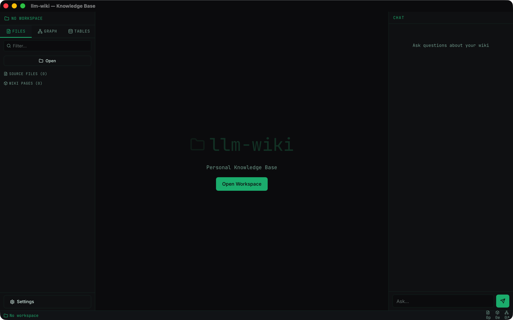
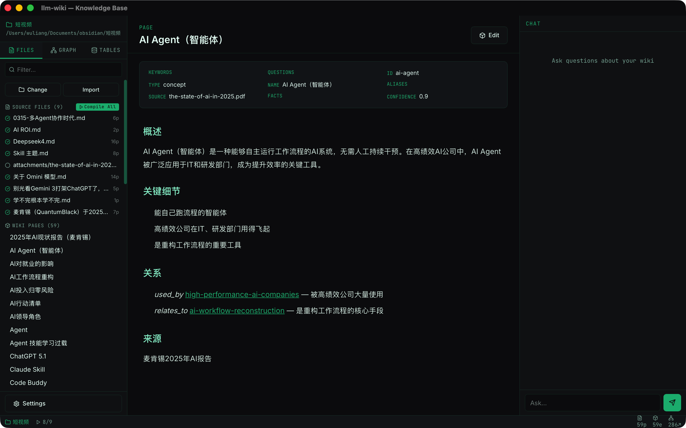
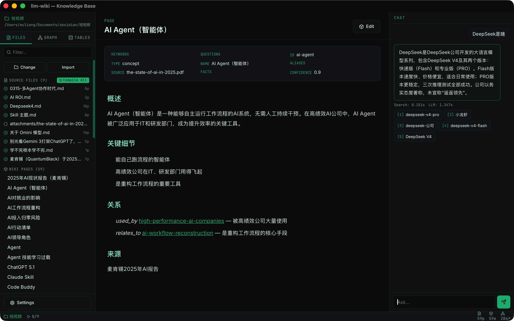
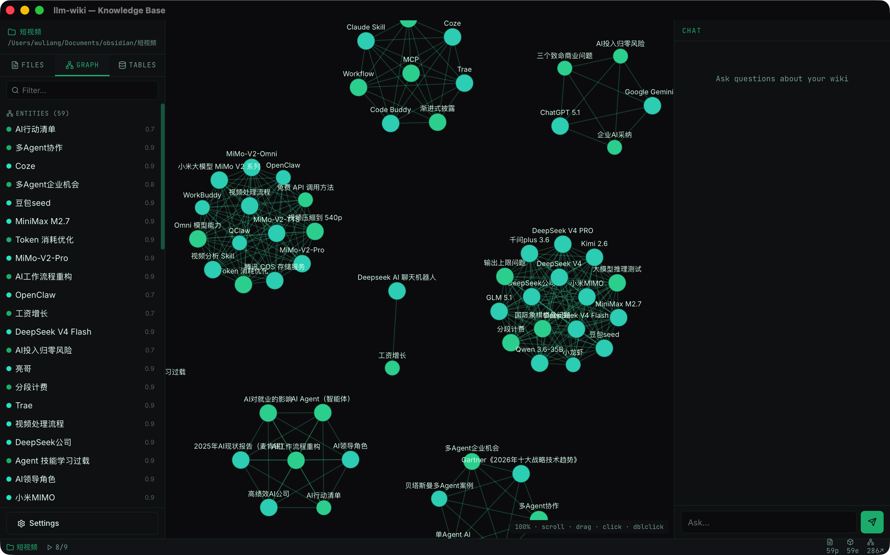

# llm-wiki

# llm-wiki

**Personal Knowledge Base powered by LLMs** — 100% Rust.  

Cross-platform desktop app (macOS/Windows/Linux) with Codex-themed UI.

Compile documents into structured wiki pages with knowledge graph linking.  
Cross-platform desktop app (macOS/Windows/Linux) with Codex-themed UI.

## Features

- **📄 Document Compilation** — LLM analyzes markdown, PDF, images, code → structured wiki pages
- **🔍 Hybrid Search** — BM25 + metadata + knowledge graph, fused with Reciprocal Rank Fusion
- **📊 Knowledge Graph** — Auto-extracted entities & relationships, interactive 3D visualization
- **🧮 Ledger/台账** — DuckDB-backed structured tables, NL→SQL queries, CSV/JSON/Excel import
- **💬 Chat** — Natural language Q&A over your wiki with source citations
- **⚡ liteparse** — Native Rust PDF text extraction (OCR optional)
- **🎨 Codex UI** — Dark theme, terminal green accents, JetBrains Mono, split panels

## Screenshots

| Main Window | Graph View |
|:---:|:---:|
|  |  |

| Chat & Search | Settings |
|:---:|:---:|
|  |  |

## Quick Start

### Install

```bash
# macOS
brew install llm-wiki        # (coming soon)

# Or build from source
git clone https://github.com/anomalyco/llm-wiki-rust
cd llm-wiki-rust
npm install && npm run tauri build
```

The app will be at `target/release/bundle/macos/llm-wiki.app`

### CLI

```bash
# Install CLI binary
cargo build -p llm-wiki-cli --release
cp target/release/wiki ~/.local/bin/

# Initialize a wiki
wiki init

# Compile a document
wiki compile document.md

# Query your knowledge base
wiki query "What is DeepSeek?"

# Full list of commands
wiki --help
```

### Configuration

Create `~/.config/llm-wiki/wiki_config.yaml`:

```yaml
model:
  provider: deepseek
  api_key: "sk-your-key"
  model: deepseek-v4-flash
  temperature: 0.3

liteparse:
  ocr_server_url: ""     # Optional OCR endpoint
  ocr_language: chi_sim+eng
  ocr_enabled: false

query:
  max_results: 5
  llm_synthesis: true
```

Or use the GUI: **⌘,** → Settings window.

## Architecture

```
llm-wiki-rust/
├── core/          # Shared library (config, search, compile, graph, ledger, llm)
├── cli/           # CLI binary (wiki)
├── src-tauri/     # Tauri desktop app (menu, commands, window management)
├── src/           # React frontend (Codex UI, chat, graph, markdown viewer)
└── Cargo.toml     # Workspace root
```

| Layer | Tech |
|-------|------|
| Desktop | Tauri 2 (Rust) |
| Frontend | React 19 + TypeScript + Vite |
| CSS | Tailwind v4 + custom Codex theme |
| Database | DuckDB (bundled) |
| PDF | liteparse (native) + OCR API (optional) |
| Search | BM25 + jieba-rs + RRF fusion |
| Graph | Canvas 2D force-directed |

## Commands

| Command | Description |
|---------|-------------|
| `wiki init` | Initialize wiki directory structure |
| `wiki compile <file>` | Compile source → wiki pages |
| `wiki query "..."` | Search + LLM synthesis |
| `wiki search doctor` | Diagnose search index |
| `wiki lint` | Health check + auto-heal |
| `wiki ledger create/insert/show` | DuckDB table management |
| `wiki config` | Show configuration |
| `wiki status` | Wiki dashboard |

## Development

```bash
# Run tests
cargo test --workspace

# Dev mode (hot reload)
npm run tauri dev

# Release build
npm run tauri build
```

## License

Apache 2.0
